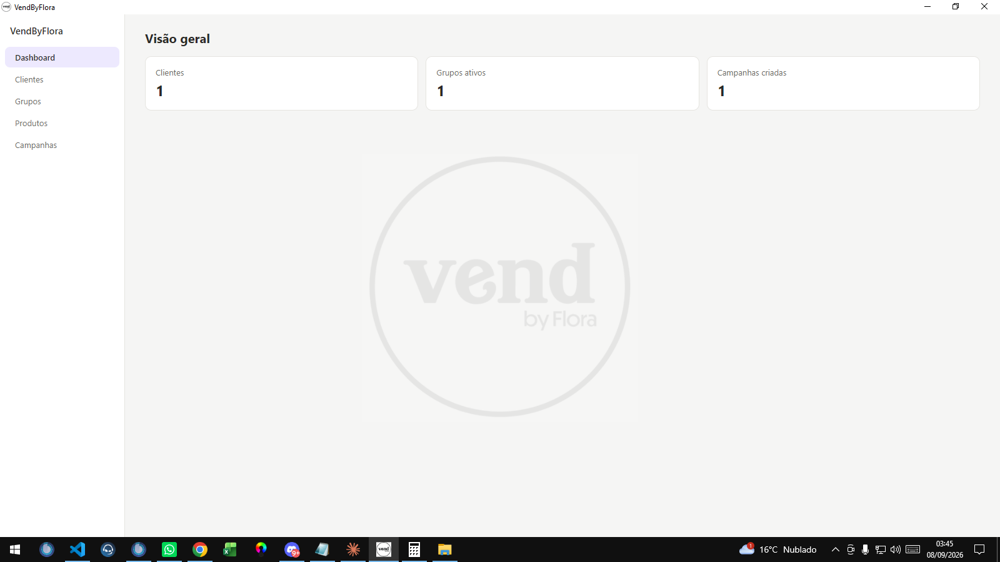
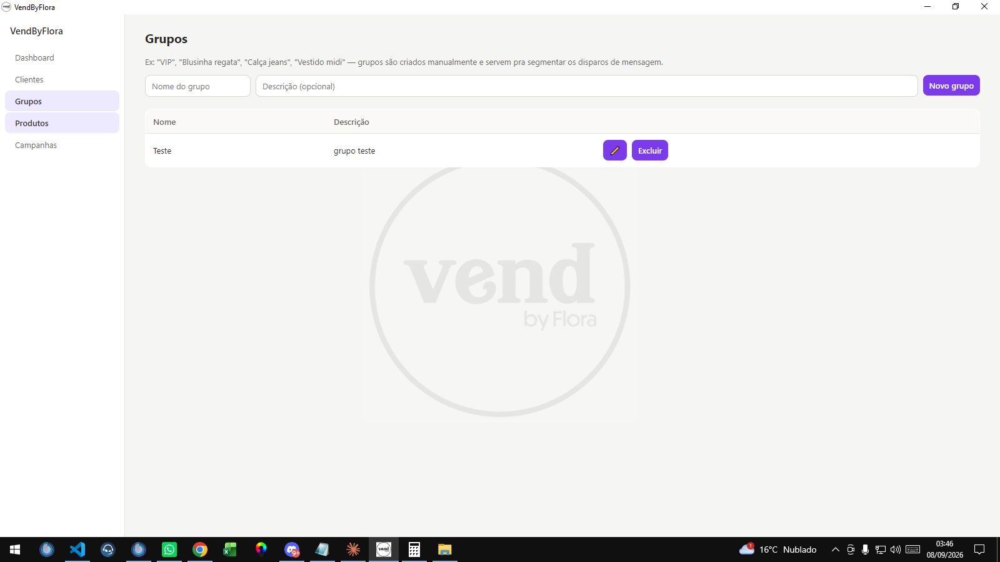

VendByFlora 🌸

Sistema desktop para lojas que querem avisar suas clientes sobre produtos novos pelo WhatsApp — sem spam, sem grupo genérico, só quem realmente tem interesse naquele tipo de peça.

O problema que ele resolve

Toda loja de roupas passa por isso: chega uma peça nova e você quer avisar as clientes certas. Mas grupo de WhatsApp normal manda pra todo mundo, mesmo quem nunca comprou aquele estilo — e isso cansa as clientes e faz elas saírem do grupo.

O VendByFlora organiza suas clientes em grupos por interesse (ex: "Vestido midi", "Calça jeans", "VIP") e, quando chega um produto novo, você escolhe só o grupo certo. O sistema já prepara a mensagem e os links do WhatsApp — você só clica e confere antes de enviar.

O que dá pra fazer
📇 Cadastrar clientes — nome, telefone e uma observação livre (ex: "prefere tons pastel")
🏷️ Organizar em grupos por interesse, não uma lista única
👗 Cadastrar produtos, cada um com várias fotos
💬 Criar campanhas — escolhe o produto, escreve a mensagem, escolhe o grupo, e o app monta a lista de clientes com o link do WhatsApp já pronto pra cada uma
🖼️ Enviar fotos junto — um botão abre a pasta com todas as fotos do produto, pra selecionar e arrastar direto pro WhatsApp
📊 Ver o histórico — quais campanhas já foram disparadas e quantas mensagens foram enviadas de cada uma
Como funciona por trás
É um programa de computador de verdade (não um site) — abre como qualquer outro programa do Windows, com ícone próprio
Todos os dados ficam salvos no seu computador, não em nenhum servidor na internet — os dados das clientes não saem da loja
A internet só entra em ação na hora de abrir o WhatsApp pra enviar a mensagem
Tecnologias usadas
Camada	Tecnologia
Janela do programa	Electron
Tela / interface	React + Vite
Dados salvos	SQLite (via sql.js)
Comunicação interna	Express (rodando só localmente, sem acesso externo)
Como rodar o projeto

Capturas de tela >>>> 

Pré-requisito: ter o Node.js instalado.

bash
# 1. Instala as dependências do programa
npm install

# 2. Instala as dependências da tela (frontend)
cd frontend
npm install
cd ..

Pra rodar em modo desenvolvimento, precisa de dois terminais abertos ao mesmo tempo:

bash
# Terminal 1 — deixa rodando
npm run dev:frontend

# Terminal 2 — abre a janela do app
npm start
Como gerar o instalador (.exe)
bash
npm run dist

O instalador pronto aparece na pasta dist/.

Sobre este projeto

Este foi meu primeiro projeto como desenvolvedor de sistemas — construído pra resolver um problema real de uma loja física, e ao mesmo tempo aprender na prática como um sistema desktop completo é feito: banco de dados, interface, e integração com um app externo (WhatsApp).

Desenvolvido por LuizCodeLab